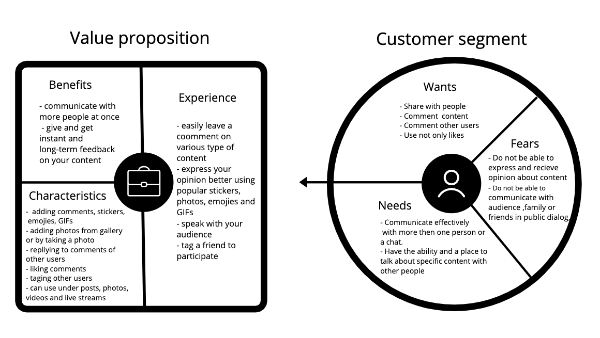
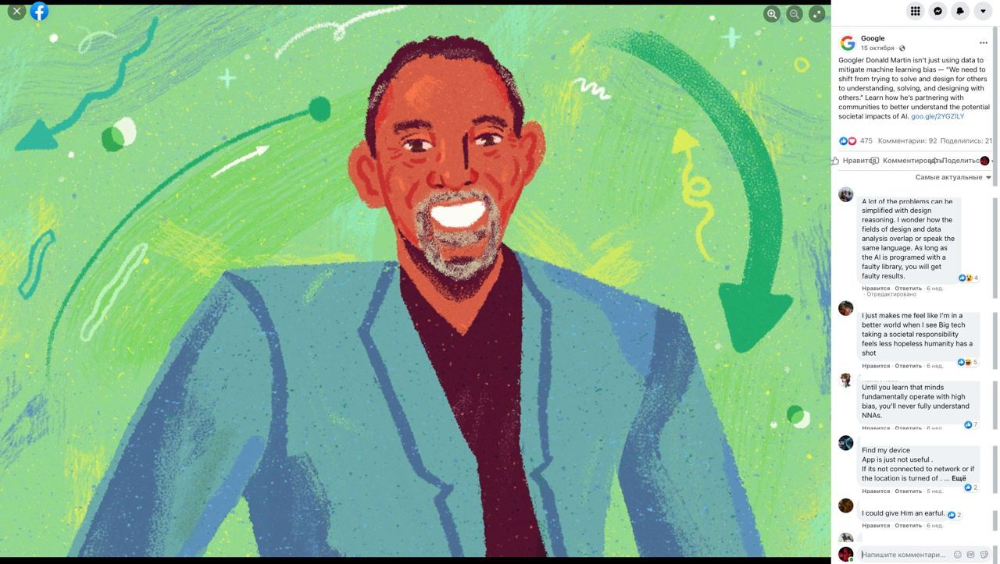
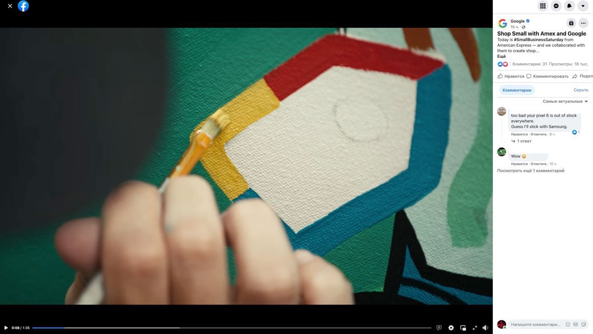

# Table of contents
  [Test task objective](#task)
1. [Business requirement document (BRD) tamplate](#brd)
2. [Feature specification document:Facebook Commenting feature](#feature)

   
Test task objective 
===================

1.  Describe a perfect BRD template, that you consider to be the most flexible and reference
    
2.  Based on the described BRD template, describe the ‘Comments’ feature in Facebook
    

> What will be paid attention to when checking the assignment?

>   * How much do you own "Helicopter view"   
>   * A clear description of the purpose of the feature / project
>   * Elaboration of functional-non-functional requirements
>   * The quality of the written scenarios
>   * Description of the fake API, as a technical part of BRD will be a plus
>   * For all controversial questions create a list of open questions
   

1.Business requirements document template 
---------------------------------------

### Objectives of a business requirement document

A [business requirements document (BRD)](https://en.wikipedia.org/wiki/Business_requirements#Business_requirements_topics) is a formal document that contains goals and expectations of an organisation aims to achieve by partnering with a vendor to complete a specific project.

*   Communicate to the technology server provider, the business needs, the customer needs, and what the solution needs to do to satisfy vendor and customer needs
    
*   Get an agreement among stakeholders
    
*   Determine the input to the next phase of the project
    
*   Describe in details the needs of a customer and a vendor that the solution intends to meet
    

The main BRD components
-----------------------

*   Executive summary
*   Project overview and objectives
*   Business requirements
*   Project Solution
*   Scope
*   Features
*   Functional and Non-Functional requirements
*   Personnel requirements
*   Assumptions
*   Quality assurance and reporting
*   Delivery schedule
*   Risks
*   Glossary of Terms
    

### Executive summary

The executive summary indicates the purpose and content of the rest of the document. It describes the project's primary goal, the issue it is facing and has a few words about how great the client's decision to choose your company was.

### Project overview and objectives

In this section, you'll go into detail about the project. It would be best if you considered including overall goals for the project, a description of what the project will accomplish, the background of the project, business drivers that make this project necessary (operational, market, environmental, financial), and a description of the current and proposed process(better-using visualization)

### Business requirements

Here is where you'll cover your goals in greater detail. The description has to be specific, measurable, actionable, realistic, and time-bound (SMART). Consider your priorities. For example, designate your requirements as critical, high priority, medium priority, low priority, or a future requirement.

### Project Solution

Description of what new solution brings to client business and overall strategy. What are the following objectives that should occur upon the full implementation of the project?

### Scope

The project scope is one of the most critical sections in your BRD. It explains what your organization and vendor are responsible for. Good to be as detailed as possible and don't make any assumptions. 

### Features

The list of features that the company will introduce upon completion of the project. Including a brief description of what it should give to the user for every specific feature.

### Functional requirements

The Functional requirements section is where to put more details about the structure behind what the user of the end product or service sees. You may add appropriate subsections, data flow diagrams, and flowcharts. Describe methodology framework (Agile, Waterfall, Scrum, Kanban). Provide a visualization of system use cases with a text description of what changes were put in place by the project.  

### Personnel requirements

For some business projects, the identity of personnel is just as critical as any other requirements. Therefore, include enough detail to address those needs in the context of the rest of the project and any potential impacts on the project budget.

### Assumptions

The assumptions outline anticipated events that would occur during the project.

### Quality assurance and reporting

The Reporting and Quality Assurance section will outline how progress is being measured and assessed along the way. Clearly define the methods employed to oversee progress on the project 

### Delivery schedule

Both final deadlines and detail around milestones.

### Cost & Benefit

This section holds a detailed list of all the costs involved in the project along with the cost-benefit analysis. 

### Risks

Every project has inherent risks that may cause delay or even failure of a project. 
Describe any risks that might arise with the technology used to build or support the project. Description of any risks that might arise regarding the skills necessary to deliver the project. Description of any risks arising from internal business environment forces or those caused by local, state, or country changes. Description of any risks to the company if the project ends up getting canceled or delayed. Description of any risks that could arise because of issues with the requirements. For example, what could happen to the project timeline if you discovered that a section of the requirements was incomplete.

### Glossary of Terms

Add a glossary if there are a lot of technical terms that need defining to add clarity to the document. 

2.Feature specification document  
==============================

> [**Features specification**](https://en.wikipedia.org/wiki/Functional_specification) is a part of a BRD
<!-- > [PRD(Product requirement document)](https://en.wikipedia.org/wiki/Product_requirements_document) -->
<!-- >
> **Product requirement document** defines the purpose of the product or particular functionality — including details on what you are building and the value it provides. -->
>
> **Feature specification** is a written description of a feature of a system. A feature of a system is user-visible aspect of the system that provides the user some benefit. 

#### Main components of Feature specification

*   Background
*   Feature value and objective
*   Value proposition diagram
*   How it works
*   Mockups
*   User scenarios
*   Functional and Non-Functional requirements
*   User Stories
*   Metrics
    

### Feature specification document: [Facebook](https://www.facebook.com/) Comments Feature

#### Background

From day one, Facebook's main idea and concept is a tool to connect people, their families, and friends. Therefore for Facebook's brand and business, comments are a great communication instrument to develop. Another reason is an opportunity for a more significant amount of people to communicate publicly. Therefore, this tool opens up the possibility of spreading exciting facts, knowledge, or news among many people and doing it much faster than using only private messages or posts.

#### Feature value and objective

#### How it works

As a user of the social network Facebook you can take part in public communication by leaving a comment under your own or someone's post, photo, video, or live video stream. In addition, you can use additional features like attaching pictures, stickers, GIFs, or emojis to your comment or send a reaction to someone else's comment.

#### Mockups:

##### Mobile app

*   comments under the photo on a user page
    
|  |  |

*   comments under the post in a news feed
    
|  |  |

##### Web browser

*   comments under the photo on a user page
    

*   comments under the video on a user page
    

#### User scenarios

* Ann is a content manager for a booking agency. Every time there is a new event coming on, she posts about it, including specific details like date, venue, prices, and maybe some limitations on the entrance. Usually, there's a lot of questions and reactions in the comments under the post. They contain everything from emotional reactions about an upcoming event to organizational questions about the place, tickets, or date. As a content manager, Ann can use these questions in the following posts as a functional requirement, make them more straightforward and do her job better.

* Max is a customer support manager for a booking agency where Ann is working. He helps with all the questions and problems that customers have. They can send questions by email, call by phone, write a personal message to a Facebook page, or leave a comment under the post. The last one is beneficial for Max because he can reply publicly to customers' comments so that other customers with the same questions can see it.

* Jack bought a ticket for the band's upcoming concert he's been a fan of for a long time. The band is brought to the city by the booking agency where Ann and Max are working. Jack knows that the agency has an active Facebook page, so he goes to check it out. He sees the post about the event he's bought a ticket to and starts interacting with other people in the comments, showing that he's happy and looking forward to going there. He sends photos of himself with the band in another city, uses funny stickers, and communicates actively. The moderator interested in the activity on the page sees it and makes a context to get a free ticket for being the most active fan. Surely Jack wins the ticket and takes his friend to the concert for free.

### Functional / Non-Functional requirements

|     |     |
| --- | --- |
| **Functional requirements** | **Non-Functional Requirement** |
| User can click on the comment button and input | Comment button and input should be visible |
| User can enter text and symbols to the input | Validation required |
| User can send a comment by pressing Enter(Web) or Send Button(Mobile) | The comment is immediately visible in comment input |
| User can reply to a comment by pressing Reply Link | User is immediately in the comment input where the name of the user user is replying to is mentioned |
| User can like to a comment by pressing Like Link | Like is immediately visible in comment input |
| User can attach Emoji by pressing Emoji icon and choosing the preferable one | Emoji is immediately visible in comment input |
| User can attach Sticker by pressing Sticker icon and choosing the preferable one | Sticker is immediately visible in comment input |
| User can attach GIF by pressing GIF icon and choosing the preferable one | GIF is immediately visible in comment input |
| User can attach Photo by pressing Photo icon and choosing the preferable photo from gallery (Web or Mobile) | Photo is immediately visible in comment input |
| User can attach Photo by pressing Photo icon and choosing the phone camera to shoot a photo | Photo is immediately visible in comment input |

#### User stories

|     |     |     |     |
| --- | --- | --- | --- |
| **Epic** | **As a** | **I want to..** | **So that** |
| Comment action | Mobile user/Web user | Leave a comment on the post in the news feed | I can share my reaction or opinion |
|| Mobile user/Web user | Leave a comment on the photo in the news feed | I can share my reaction or opinion |
|| Mobile user/Web user | Leave a comment on the video in the news feed | I can share my reaction or opinion |
|| Mobile user/Web user | Leave a comment on the post on users page | I can share my reaction or opinion |
|| Mobile user/Web user | Leave a comment on the photo in users photos | I can share my reaction or opinion |
|| Mobile user/Web user | Leave a comment on the video in users videos | I can share my reaction or opinion |
|| Mobile user/Web user | Leave a comment on the live stream video | I can share my reaction or opinion |
| Reply action | Mobile user/Web user | Reply to a comment on the post in the news feed | I can share my reaction or opinion with specific user |
|| Mobile user/Web user | Reply to a comment on the photo in the news feed | I can share my reaction or opinion with specific user |
|| Mobile user/Web user | Reply to a comment on the video in the news feed | I can share my reaction or opinion with specific user |
|| Mobile user/Web use | Reply to a comment on the post on users page | I can share my reaction or opinion with specific user |
|| Mobile user/Web use | Reply to a comment on the photo in users photos | I can share my reaction or opinion with specific user |
|| Mobile user/Web use | Reply to a comment on the video in users videos | I can share my reaction or opinion with specific user |
|| Mobile user/Web use | Reply to a comment on the live stream video | I can share my reaction or opinion and do it in dynamic context of stream |
| Attachments to the comments | Mobile user | Attach photo using my phone camera, not leaving comment section | i can give an instant visual reaction not leaving the app |
|| Mobile user/Web user | Attach photo to the comment from my gallery | i can give visual reaction not leaving the app |
|| Mobile user/Web user | attach emoji to the comment | i can give visual reaction |
|| Mobile user/Web user | attach stickers to the comment | i can give visual reaction |
|| Mobile user/Web user | attach GIFs to the comment | i can give visual reaction |
|| Mobile user/Web user | tag other user or page | so that tagged user or group could know about this comment |

### Questions

* Is it meant that all User stories 'So thats' should be unique? 

